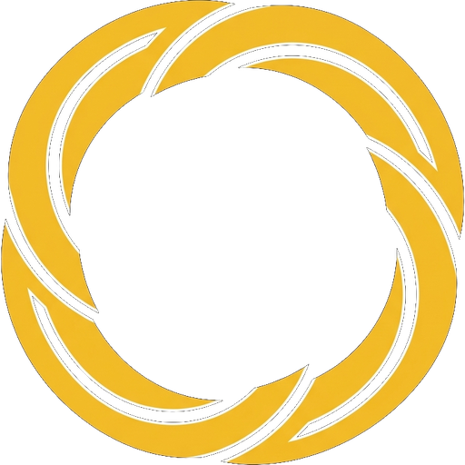
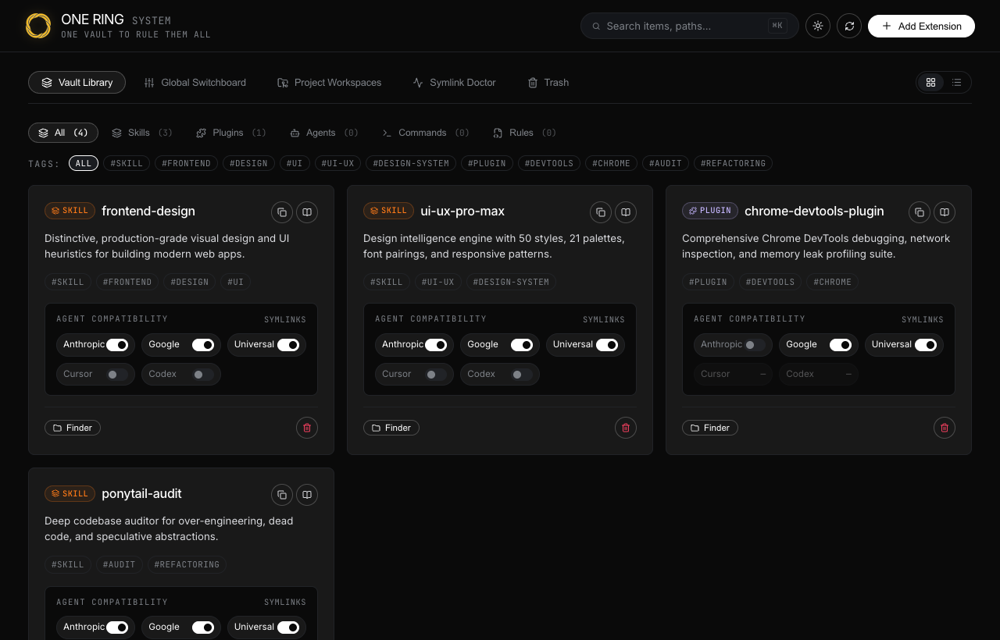
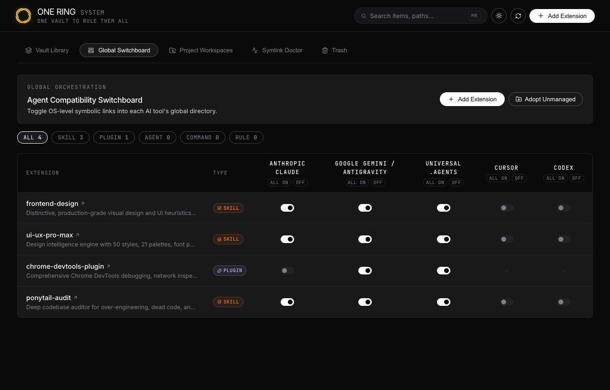
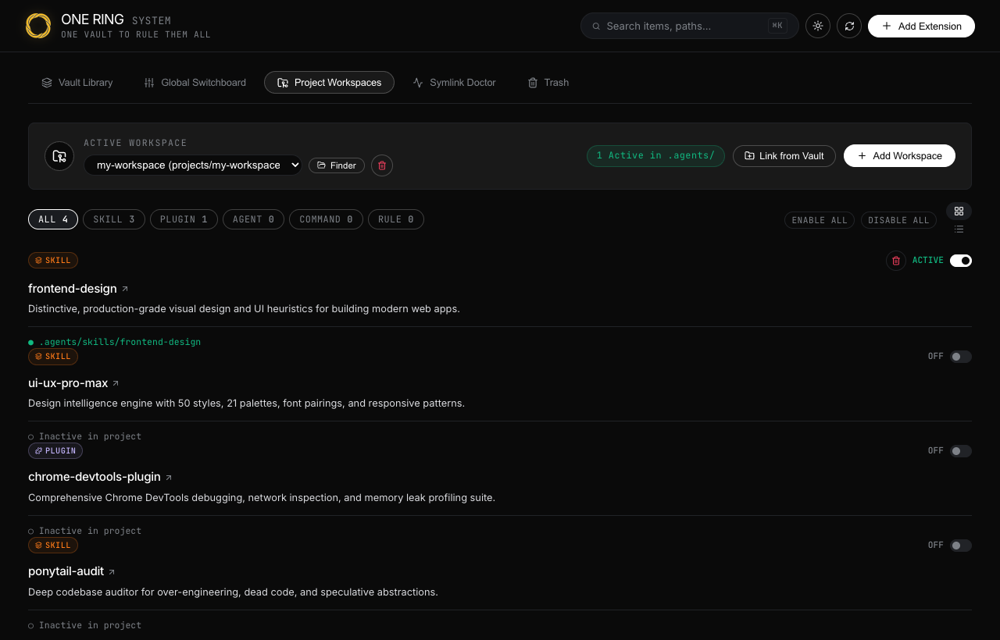
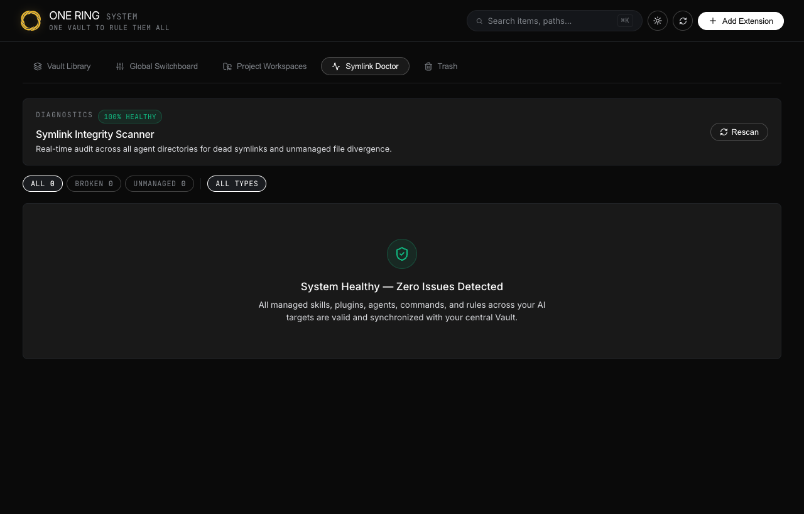

<div align="center">



# ONE RING SYSTEM

### *One Vault to rule them all*

**A unified, minimalist desktop control panel for AI agent skills, plugins, custom agents, CLI commands, and prompt rules across multiple AI coding environments.**

[](https://v2.tauri.app/)
[](https://www.rust-lang.org/)
[](https://react.dev/)
[](https://vitejs.dev/)
[](#-cross-platform)
[](LICENSE)

</div>

---

## ⚡ The Problem

AI coding environments are multiplying fast. Every assistant has its own isolated extension directory:
- **Anthropic Claude Code** (`~/.claude/skills/`, `~/.claude/commands/`)
- **Google Antigravity & Gemini CLI** (`~/.gemini/config/skills/`, `plugins/`, `rules/`)
- **Cursor AI** (`.cursor/rules/`, `.cursorrules`)
- **Universal `.agents` Standard** (`.agents/skills/`, `.agents/rules/`, `.agents/plugins/`)
- **OpenAI Codex** (`~/.codex/skills/`)

Developers end up with **scattered duplicate files**, **out-of-sync edits**, broken local project configs, and zero visibility into what extensions are active where.

---

## 💍 The Solution: One Ring

**One Ring** introduces a single source of truth. All your skills, plugins, agents, commands, and rules live once in a central isolated Vault (`~/.one-ring/vault/`) and are mapped into your global CLI targets or individual project repositories via **pure, lightning-fast OS-level symbolic links**.

- 🚀 **Zero File Duplication**: Edit once in the Vault, and changes instantly reflect everywhere.
- ⚡ **Native Speed & Zero Bloat**: Built with **Rust (Tauri v2)** and **React 19**. 100% in-memory native IPC with zero background daemons.
- 🛡️ **2-Stage Quarantine Trash**: Quarantines deletions in `~/.one-ring/trash/` with 1-click instant rollback before permanent disk purge.
- 🩺 **Symlink Doctor**: Real-time diagnostic engine that detects broken links, dead targets, and unmanaged file copies with 1-click auto-adoption.

---

## 📸 Interface & Capabilities

### 1. Vault Library (Single Source of Truth)
Manage your complete catalog of skills, plugins, agents, commands, and rules. Toggle global agent compatibility with interactive minimalist switches or inspect full markdown source code.

<div align="center">
  
</div>

---

### 2. Global Cross-Agent Switchboard
A matrix grid for mass-activating extensions across multiple agent CLIs (Claude, Gemini, Universal `.agents`, Cursor, Codex) in a single click.

<div align="center">
  
</div>

---

### 3. Project Workspace Matrices
Register local repositories and dynamically enable or disable extensions specifically for that codebase inside `.agents/` or `.claude/` with zero cross-project pollution.

<div align="center">
  
</div>

---

### 4. Symlink Doctor & Diagnostics
Continuous integrity scanner that finds broken symbolic links and unmanaged copy divergence across your filesystem. Convert rogue copies into managed Vault symlinks with one click.

<div align="center">
  
</div>

---

## 🏛️ System Architecture

```
                       ┌──────────────────────────────────────────────┐
                       │              THE CENTRAL VAULT               │
                       │             (~/.one-ring/vault/)             │
                       │  • skills/   • plugins/   • agents/  • rules │
                       └──────────────────────┬───────────────────────┘
                                              │
                         OS-Level Symbolic Links (Atomic & Fast)
                                              │
            ┌─────────────────────────────────┴─────────────────────────────────┐
            ▼                                                                   ▼
   GLOBAL CLI TARGETS                                                  PROJECT WORKSPACES
   ├─ Anthropic Claude (~/.claude/)                                    ├─ /repo-a/.agents/skills/
   ├─ Google Gemini / AGY (~/.gemini/config/)                          ├─ /repo-b/.claude/skills/
   ├─ Universal Standard (~/.agents/)                                  ├─ /repo-c/.cursor/rules/
   ├─ Cursor AI (~/.cursor/rules/)                                     └─ ...
   └─ OpenAI Codex (~/.codex/)
```

### Backend IPC (`src-tauri/`)
- **`vault.rs`**: Isolates filesystem operations and manages schema manifests under `~/.one-ring/vault/`.
- **`symlink.rs`**: Cross-platform atomic link creation, recursive parent directory generation, and symlink target validation.
- **`adapters.rs`**: Target registry mapping CLI paths and extension folder layouts for all supported agents.
- **`projects.rs`**: Persistent workspace registry stored in `~/.one-ring/projects.json`.
- **`trash.rs`**: 2-stage quarantine and staging system backed by `~/.one-ring/trash/manifest.json`.
- **`doctor.rs`**: Deep health scanner for filesystem discrepancy analysis.

---

## 🎯 Supported Target Matrix

| Target Agent | Configuration Root | Supported Extension Types |
| :--- | :--- | :--- |
| **Universal `.agents`** | `~/.agents/` & `<project>/.agents/` | `skill`, `plugin`, `agent`, `command`, `rule` |
| **Google Gemini / Antigravity** | `~/.gemini/config/` | `skill`, `plugin`, `rule`, `command` |
| **Anthropic Claude Code** | `~/.claude/` | `skill`, `command` |
| **Cursor AI** | `~/.cursor/rules/` & `<project>/.cursor/` | `rule`, `skill` |
| **OpenAI Codex** | `~/.codex/skills/` | `skill` |

---

## 🚀 Getting Started

### Prerequisites
- **Node.js** (v18+)
- **Rust toolchain** (`cargo`, `rustc` 1.77+)
- **OS**: macOS, Linux, or Windows

### 1. Clone the repository
```bash
git clone https://github.com/netsirius/one-ring.git
cd one-ring
npm install
```

### 2. Run Desktop App in Development Mode
```bash
npm run desktop
```
*(Launches Vite dev server + Tauri native desktop window with hot module reloading)*

### 3. Run Web Preview (Browser Simulation)
```bash
npm run dev
```
Navigate to `http://localhost:5173`.

### 4. Build Native Production Release
```bash
npm run build
npm run tauri build
```
The optimized native application bundle will be generated in `src-tauri/target/release/bundle/`.

---

## ⌨️ Keyboard Shortcuts

| Shortcut | Action |
| :--- | :--- |
| **`⌘K` / `Ctrl+K`** | Focus global search bar from anywhere |
| **`Esc`** | Close slide-over inspectors and modal dialogs |

---

## 🎨 Design Principles

- **xAI / Linear Engineered Aesthetics**: Pure obsidian canvas (`#0a0a0a`), hairline 1px borders (`#212327`), and high-contrast typography.
- **Zero Drop Shadows**: Elevation is communicated through hairline borders and subtle surface contrast.
- **Micro-Interactions**: Smooth state transitions, instant optimistic UI updates, and non-blocking background workers.

---

## 📄 License

This project is licensed under the [MIT License](LICENSE).
